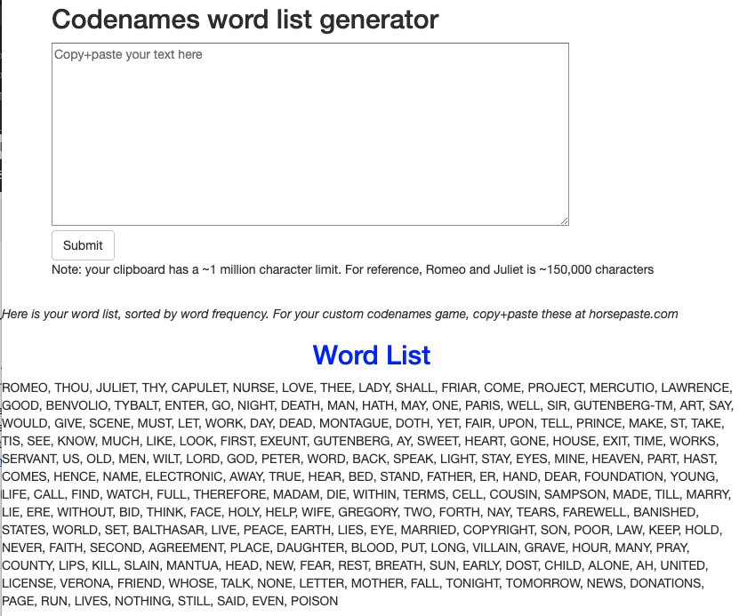

# Codenames Flask
During the time of COVID-19 social isolation, many social groups are turning to online games such as [Codenames](horsepaste.com). This online version allows users to edit the word list, so I made a simple tool to extract common words from any corpus. Built with Flask and deployed to AWS Elastic Beanstalk. 

Was deployed on 3/24/2020 (will be removed soon to avoid incurring costs) to http://codenames-flask.eba-xrpqjypq.us-east-2.elasticbeanstalk.com/predict   
Sample output from the [Romeo and Juliet corpus](https://www.gutenberg.org/files/1513/1513-h/1513-h.htm): 


## Running locally
```
export FLASK_APP=app.py
export FLASK_DEBUG=1
flask run 
```
And navigate to the path in your browser


## Deployment
DICLAIMER - these are not intended to be complete or up-to-date instructions. They document the process I did on 3/27/2020 following the [Deploying a flask application to Elastic Beanstalk docs](https://docs.aws.amazon.com/elasticbeanstalk/latest/dg/create-deploy-python-flask.html).  
1) Create local environment, and save 
```
cd ~/github/blog/codenames_flask
conda create -n eb_flask python=3.6 pip
conda activate eb_flask
pip install flask==1.0.2
pip install nltk stop_words
pip freeze > requirements.txt
```

2) Ensure it works locally.  
Run `python application.py` and navigate to `http://127.0.0.1:5000/` in your browser.  

3) Install the EB CLI as per the [docs](https://github.com/aws/aws-elastic-beanstalk-cli-setup).  
Since we have git/python already, it's fairly simple. Note that I'm specifying the specific python path so that my system Python 2 doesn't interfere.  Additionally, I had to `pip install virtualenv` (since I normally use `conda`)
```
cd ~/github
git clone https://github.com/aws/aws-elastic-beanstalk-cli-setup.git
/Users/zrankin/miniconda3/envs/eb_flask/bin/python aws-elastic-beanstalk-cli-setup/scripts/ebcli_installer.py
```
As per the returned output, add the path. 
```
echo 'export PATH="/Users/zrankin/.ebcli-virtual-env/executables:$PATH"' >> ~/.bash_profile && source ~/.bash_profile
```
And confirm with `which eb`.  

4) [Configure the EB CLI](https://docs.aws.amazon.com/elasticbeanstalk/latest/dg/eb-cli3-configuration.html).  
Easiest way is to navigate to https://console.aws.amazon.com/iam/home#/security_credentials, click "Access Keys" -> Create New Access Key  

5) Create and deploy.  
Initialize repo  
`eb init -p python-3.6 codenames-flask --region us-east-2`  
(note - as of now I'm not enabling ssh access, see docs for more).  
Create app  
`eb create codenames-flask`

6) Go to your website!  
`eb open`   

7) [Troubleshoot](https://docs.aws.amazon.com/elasticbeanstalk/latest/dg/troubleshooting-deployments.html).  
The AWS troubleshooting is pretty slim and doesn't cover many gotchas described by this [helpful guide](https://medium.com/@pbojinov/elastic-beanstalk-and-flask-c51e10de7fe0).  
You can get the error logs by `eb logs`
Some mistakes I made: 
- One mistake I made that the docs didn't explicitly cover is that by default, the local app (with debugger) will host on `127.0.0.1` (localhost). You may need to specify `app.run(host="0.0.0.0")`. Otherwise your deployed app will have `Internal Server Error`.   
- EB asssumes that your module is named `application.py` AND that the class instance is called `application` (e.g. `application = Flask(__name__)`)
- You need to download some nltk files for the tokenization (again, use `eb logs` to find this out). In `application.py`, I included `nltk.download("punkt", download_dir = "/tmp")`  

8) After updates, run `eb deploy` to push updated application.   

9) when the novelty runs out, you can configure/delete your app on the [EB console](https://console.aws.amazon.com/elasticbeanstalk/home) (or the EB CLI)


## Resources
- Free corpuses at https://www.gutenberg.org/
- [Jinja templating docs](https://jinja.palletsprojects.com/en/2.11.x/templates/)
- https://towardsdatascience.com/develop-a-nlp-model-in-python-deploy-it-with-flask-step-by-step-744f3bdd7776
- https://realpython.com/flask-by-example-part-3-text-processing-with-requests-beautifulsoup-nltk/
- https://github.com/aws-samples/eb-python-flask

## Next stpes: 
- Use stemming to combine tenses & plurals (https://www.nltk.org/howto/stem.html)
- TFIDF?
- display word cloud
- configurable n words to return?
