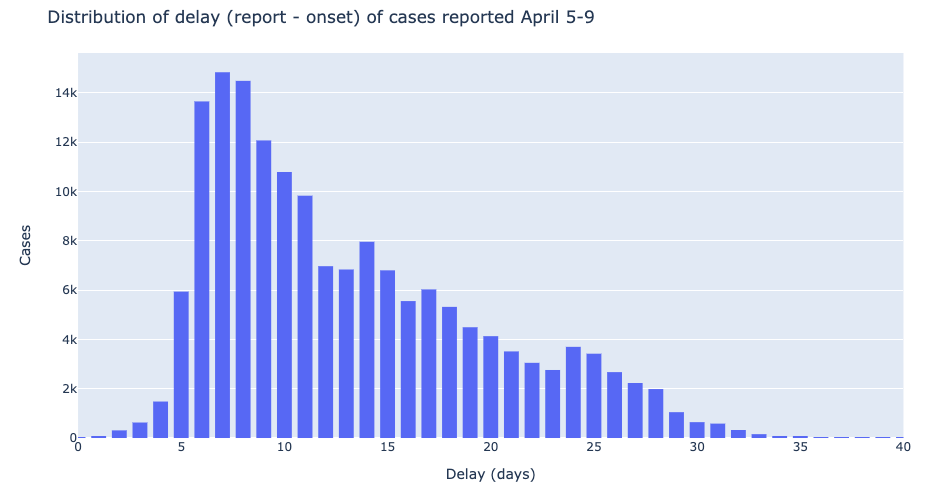

## Summary
Investigating the delay in CDC COVID-19 case reports from https://www.cdc.gov/coronavirus/2019-ncov/cases-in-us.html.  
The CDC chart shows cases by onset, stating that cases in the last 11 days are not fully reported (presumably matching the COVID incubation period).  
  
However, I have observed that newly reported cases are from further back than the 11 day window, likely due to the combination of incubation period, testing delay, and reporting delay. 

Indeed, the median delay of new cases reported April 9 was 11 days, with many cases taking 2-3 weeks from illness onset to reporting.   

Here is a plot looking at how March case totals continue increasing well into April. 

Using the cumulative distribution of reporting delays, you can approximate the final number of cases contracted in March. 


## Data
Data was scraped from the underlying data for the charts on https://www.cdc.gov/coronavirus/2019-ncov/cases-in-us.html.  
CDC data is updated daily at noon.  
There are two plots of interest, with the following underlying data:  
- https://www.cdc.gov/coronavirus/2019-ncov/cases-updates/total-cases-onset.json
- https://www.cdc.gov/coronavirus/2019-ncov/cases-updates/us-cases-epi-chart.json

Raw data is in `data/raw`, and the processed data is in `data/covid_cases.csv`.  
Data is manually refreshed (I promise no update frequency) by running `data.py`

## Reproducibility
As of 4/11 there are no plans to make this a proper Python package.  
The dependencies are simple so I suggest setting up your own `conda` environment
```
conda create -n covid python=3.7 pip
source activate covid
pip install pandas plotly jupyter
```
Then run the notebooks by
```
cd notebooks
jupyter notebook
```
