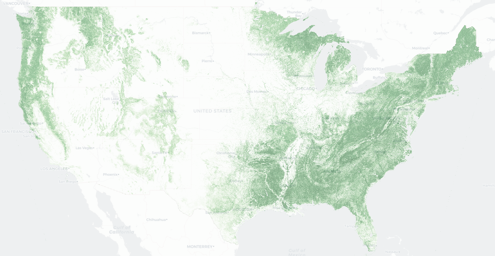
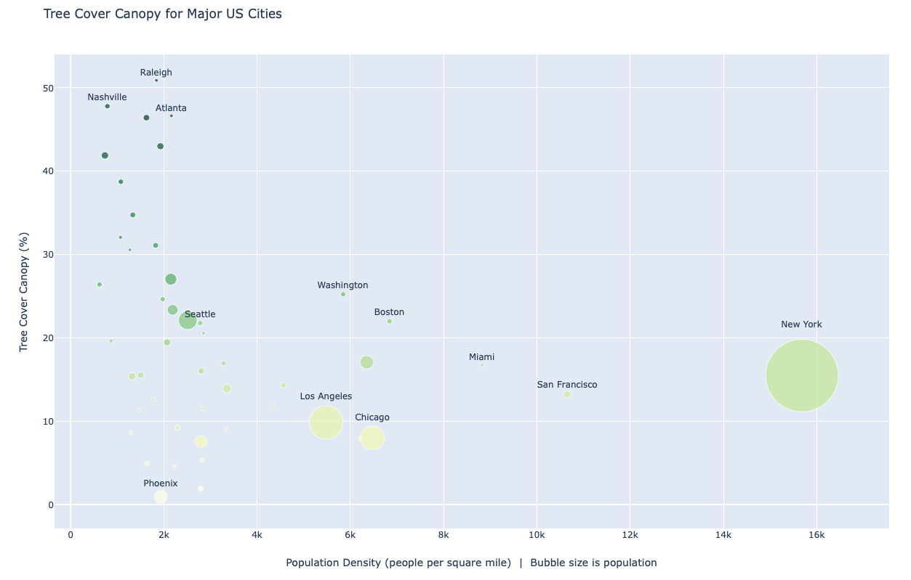
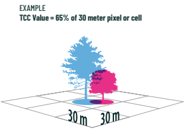

# Tree Canopy Cover (TCC)
This blog is somewhat perpetually "in progress." As of March 26, I'm pushing it to master with some initial plots.  I hope to write more in-depth analysis soon. The draft blog post can be found at:  http://zanerankin.com/blog/tree-canopy-cover/


Initial work included making interactive plots of TCC, the interactive version of which can be found at https://zanerankin.com/blog/tree_canopy_cover/output/map_tcc_usa_1km_city_overlay.html. 
 
Additionally, I aggregated TCC by metropolitan area to determine which cities (and eventually, neighborhoods) had the most tree cover. The interactive version of the plot can be found at https://zanerankin.com/blog/tree_canopy_cover/output/tcc_by_city_scatter.html. 
. 

## Data 
- Raw data Downloaded as per `download_conus_2016.sh` from https://data.fs.usda.gov/geodata/rastergateway/treecanopycover/index.php. For background, see the [USFS Tree Canopy Cover brochure](https://data.fs.usda.gov/geodata/rastergateway/treecanopycover/docs/TCC_Tri-fold_2020-01-03.pdf)  

- There are additioanlly some files (e.g. lower resolution shapefiles) that were processed by a script (`tree_canopy_cover.py`) and can be found (with additional documentation) here: https://www.kaggle.com/zwrankin/usfs-tree-canopy-cover. This was largely to accomodate Kaggle Datasets 20GB limit. The Kaggle dataset includes the city population and shapefiles downloaded from https://catalog.data.gov/dataset/500-cities-city-boundaries-acd62 

## Analysis
TCC was aggregated to city shapefiles, by taking the mean TCC for all 1x1km tiles whose centroid was within the city boundary.  
Here is the [Kaggle Notebook](https://www.kaggle.com/zwrankin/treecanopycover-starter) that you can run yourself. 

## Docker notes
Due to complex GDAL dependencies, the Kaggle [Docker image](https://github.com/Kaggle/docker-python/blob/master/Dockerfile) does not include `rasterio`. Oddly, the Kaggle kernel _does_. I inquired about that discepancy on the [kaggle forum](https://www.kaggle.com/questions-and-answers/135197).  
In the meantime, you can either create your own Docker image, or run this analysis in the Kaggle kernel (see starter notebook [here](https://www.kaggle.com/zwrankin/treecanopycover-starter)) as per the instruction in the main blog README.  
However, if you want to use the raw raw CONUS_2016 data (which has the highest resolution 30x30meter grid), here are some dependencies to include in your `Dockerfile`. 
```
RUN pip install GDAL==2.4.2 && \
    pip install geopandas && \
    pip install rasterio && \ 
    pip install sklearn && \ 
    pip install geojson && \ 
    pip install folium && \
    pip install seaborn && \
    sudo apt-get install libgeos-dev
```
